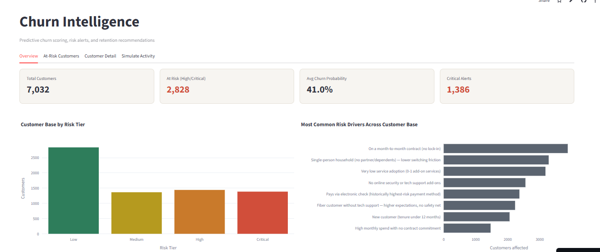
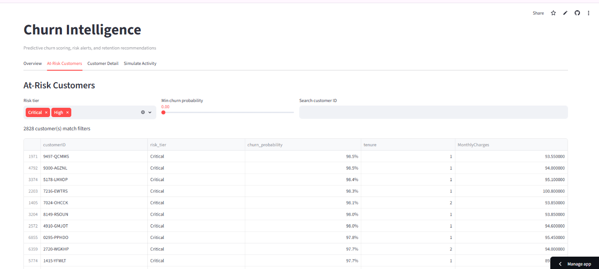
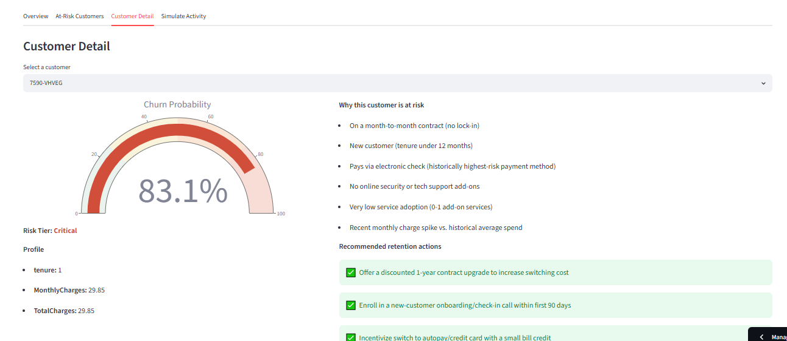
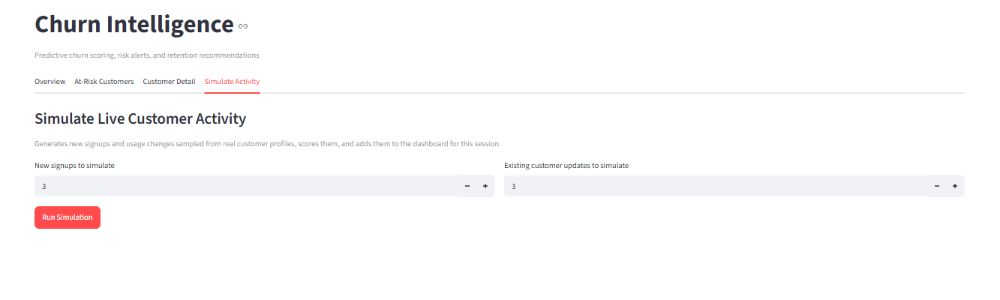
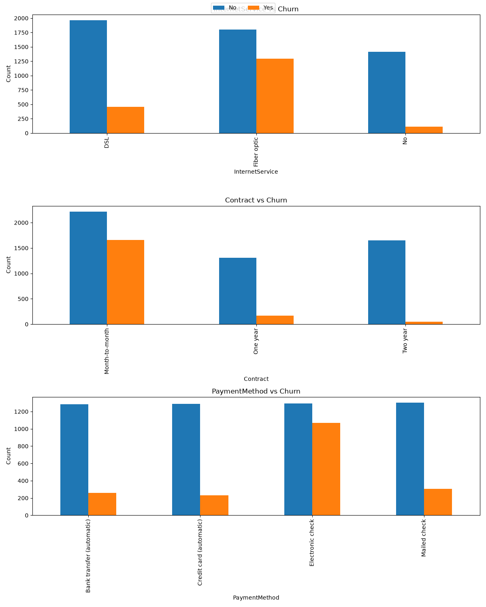
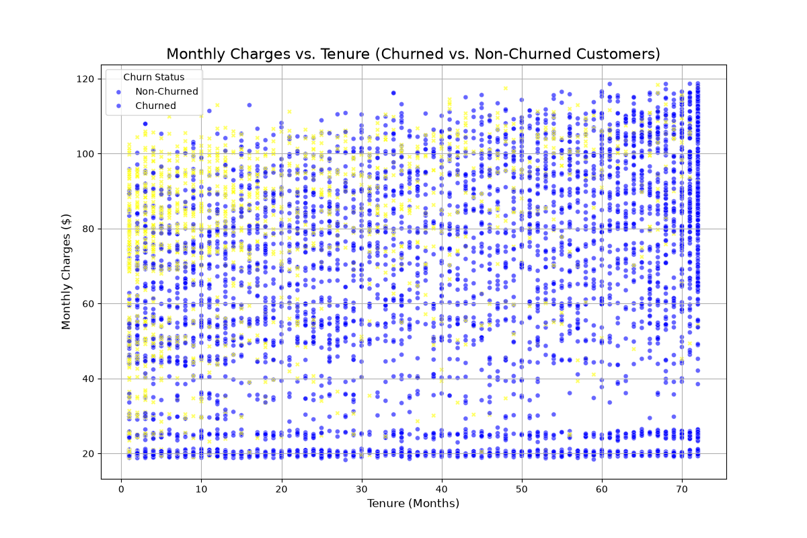

# ChurnGuard — Predictive Churn Intelligence & Retention Engine

**Predicts which telecom customers are about to leave, explains *why*, and recommends the specific retention action to take — all in one interactive dashboard.**

🔗 **Live demo:** [wuapmnthontqkgganz5bvr.streamlit.app](https://wuapmnthontqkgganz5bvr.streamlit.app/)
📂 **Dataset:** [Telco Customer Churn](https://www.kaggle.com/datasets/blastchar/telco-customer-churn) (Kaggle, IBM sample dataset)




---

## The Problem

Customer churn is one of the most expensive problems in subscription businesses — acquiring a new customer typically costs **5–25x more** than retaining an existing one. Most churn models stop at a probability score, which is not actionable on its own. A customer support or retention team doesn't just need to know *who* is at risk — they need to know **why**, and **what to do about it**.

**ChurnGuard** closes that gap: it scores every customer, explains the specific risk drivers behind that score in plain language, and recommends a concrete retention action — then surfaces all of it in a dashboard a non-technical stakeholder can actually use.

---

## What It Does

| Capability | Description |
|---|---|
| **Churn Prediction** | Scores each customer's probability of churning using a tuned ML model |
| **Risk Tiering** | Buckets customers into Low / Medium / High / Critical risk |
| **Explainability** | Surfaces the specific behavioral/contractual factors driving each customer's risk |
| **Recommendations** | Maps risk drivers to concrete retention actions (e.g., contract upsell, security bundle offer) |
| **Interactive Dashboard** | 4-tab Streamlit app: portfolio overview, at-risk customer table, single-customer deep dive, and live activity simulation |

---

## Live Demo Walkthrough

The dashboard has four tabs:

### 1. Overview
KPI cards (total customers, at-risk count, average churn probability, critical alerts) plus a risk-tier distribution chart and the most common risk drivers across the entire customer base.


On the full 7,032-customer base, **2,828 customers (40%) are High or Critical risk**, and the most common risk drivers are exactly what churn theory predicts: month-to-month contracts, single-person households, low service adoption, and electronic-check payment.

### 2. At-Risk Customers
A filterable, sortable table of every customer — by risk tier and minimum churn probability — with ID search, so a retention team can immediately pull a worklist instead of sifting through a static export.



### 3. Customer Detail
Select any single customer to see their churn probability on a gauge chart, the specific risk drivers behind that score, recommended retention actions, and a comparison of their stats against the cohort average.



This is the core "explainability + action" loop the project is built around: a customer at **83.1% churn risk** isn't just flagged — they're shown to be on a month-to-month contract, under a year of tenure, paying by electronic check, with no support add-ons and a recent charge spike — and the system recommends a discounted contract upgrade, a 90-day onboarding check-in, and an autopay incentive in response.

### 4. Simulate Activity
Generates synthetic new signups and usage-pattern changes sampled from real customer profiles, scores them live, and adds them to the dashboard for the session — demonstrating the pipeline works on unseen, streaming-style data, not just the static training file.



---

## Modeling Approach

### Data
[IBM's Telco Customer Churn dataset](https://www.kaggle.com/datasets/blastchar/telco-customer-churn) — ~7,000 customers across demographics, account info, and subscribed services. Target: binary churn (Yes/No), with a **~27% positive class** (moderately imbalanced).

### Feature Engineering
Raw columns alone don't capture *why* someone churns, so the pipeline derives ~20 engineered features from four angles:

- **Customer profile** — family/household stability scores
- **Subscription profile** — tenure buckets, contract length, customer lifetime value proxy
- **Usage & engagement** — number of subscribed services, service adoption rate, bundle detection (security bundle, entertainment bundle), "no protection" flag, new-customer-on-month-to-month risk flag
- **Billing & payment** — average monthly spend, charge volatility, autopay detection, a manually-weighted heuristic `RiskScore` combining contract type, tenure, payment method, and support subscriptions

These engineered, human-readable features also power the **explainability layer** — the same signals the model uses are translated into the plain-language risk drivers shown in the dashboard.

### Models & Tuning
Four candidate models were trained and compared:

| Model | Tuning |
|---|---|
| Logistic Regression | Baseline (no tuning), `class_weight="balanced"`, standardized features |
| Random Forest | Optuna-tuned (30 trials) |
| XGBoost | Optuna-tuned (30 trials), `scale_pos_weight` for class imbalance |
| CatBoost | Optuna-tuned (30 trials), `auto_class_weights="Balanced"` |

**Split:** Stratified 64% train / 16% validation / 20% test, with the validation set used both for Optuna's objective (ROC-AUC) and for finding the optimal decision threshold (F1-maximizing search over 0.10–0.90).

All experiments are tracked in **MLflow** (params, metrics, and model artifacts per run), and the winning model is selected by validation ROC-AUC, then confirmed on a held-out test set it never touched during tuning.

### Results

| Model | Accuracy | Precision | Recall | F1 | ROC-AUC |
|---|---|---|---|---|---|
| **Logistic Regression** ⭐ | 0.772 | 0.552 | 0.746 | **0.634** | 0.836 |
| CatBoost | 0.770 | 0.548 | 0.759 | 0.637 | 0.836 |
| Random Forest | 0.772 | 0.556 | 0.716 | 0.626 | 0.833 |
| XGBoost | 0.760 | 0.534 | 0.769 | 0.630 | 0.835 |

*(Validation set, classification threshold = 0.53)*

**Logistic Regression won** — and that's worth calling out rather than hiding. Across all four models, ROC-AUC sits in a tight 0.833–0.836 band, meaning the extra complexity of tree-based ensembles bought essentially no discriminative power on this dataset. The signal in Telco churn is largely linear/additive (contract type, tenure, payment method), so the simplest, most interpretable, fastest-to-serve model won on merit — not by default.

**Test set performance held up close to validation** (ROC-AUC 0.835, F1 0.613), indicating the model generalizes rather than overfitting to validation.

**Metric choice rationale:** Accuracy alone is misleading on a 27%-positive imbalanced target — a model predicting "no churn" for everyone would still score ~73% accuracy. The threshold was instead tuned to maximize **F1**, and **recall (0.75)** was prioritized in interpretation, because the business cost of missing a churner (lost customer, lost revenue) is higher than the cost of a false alarm (an unnecessary retention offer).

> 📊 Full exploratory analysis — distribution plots, correlation heatmaps, churn-by-segment breakdowns — is in [`notebook/eda.ipynb`](notebook/eda.ipynb).

---

## Exploratory Findings

A couple of patterns from the EDA directly motivated the feature engineering and risk-driver logic above:



**Contract type is the single strongest churn signal in the dataset.** Month-to-month customers churn at a dramatically higher rate than one- or two-year contract holders — which is exactly why `ContractRisk` and `NewHighRisk` (new customer + month-to-month) were engineered as standalone features, and why "on a month-to-month contract" shows up as the most common risk driver across the customer base in the dashboard.



**Churn risk concentrates in customers with low tenure and high monthly charges.** New customers paying a premium haven't yet had time to build switching costs or see ongoing value — this combination is what `CLV_proxy`, `ChargeGap`, and the tenure-bucketed `TenureGroup` feature are designed to capture, and it's the same pattern visible in the Customer Detail example above (tenure of 1 month, a recent charge spike, 83% churn probability).

---

---

## Architecture

```
Raw customer CSV
       │
       ▼
┌─────────────────────┐
│  data_transform.py   │  clean() → features() → encode()
│  (Datatransform)     │  raw cols → engineered features → model-ready matrix
└─────────────────────┘
       │
       ▼
┌─────────────────────┐
│   model_train.py     │  4-model bake-off + Optuna tuning + MLflow logging
│   (ModelTrainer)     │  → artifacts/best_model.pkl
└─────────────────────┘
       │
       ▼
┌─────────────────────┐
│    pipeline.py        │  orchestrates: transform → predict → explain → recommend
│   (ChurnPipeline)     │  one call in, fully scored + explained dataframe out
└─────────────────────┘
       │
       ▼
┌─────────────────────┐
│  streamlit_app.py     │  4-tab interactive dashboard
└─────────────────────┘
```

`pipeline.py` is the single integration point — it's the only thing the dashboard (or any future consumer, e.g. a batch job or API) needs to call. It takes raw, untouched customer rows and returns a dataframe with churn probability, predicted label, risk tier, risk drivers, and recommendations already attached.

---

## Explainability: SHAP vs. Rule-Based Drivers

The dashboard's Customer Detail tab shows two independent explanations side by side: the rule-based risk drivers used for the recommendation engine, and a live SHAP explanation computed directly against the trained model (`shap.Explainer` wrapping `predict_proba`, cached per session, recomputed per selected customer).

**High-risk example** — customer `7590-VHVEG`, 1-month tenure, month-to-month contract, 83.1% churn probability:

| Rule-based drivers | SHAP top drivers (impact direction) |
|---|---|
| Month-to-month contract, no online security/tech support, electronic check payment, recent charge spike | `ContractRisk`, `NewHighRisk`, `tenure`, `MonthlyCharges`, `InternetService_Fiber optic` — all pushing risk **up** |

The two methods agree closely here, which is the result you want: the heuristics aren't just plausible-sounding, they're tracking the same signal the model actually learned.

**Low-risk example** — customer `3841-NFECX`, 71-month tenure, 12.4% churn probability:

The rule-based list returns only a single driver ("senior citizen segment"), while SHAP surfaces a fuller picture — `ContractLength`, `AvgMonthlySpend`, `CLV_proxy`, `tenure`, and `ContractRisk` all pulling risk **down**, consistent with a long-tenured, long-contract customer.

**An honest finding, not a hidden one:** for the high-risk customer above, the engineered `RiskScore` feature — built specifically as a hand-crafted risk heuristic — shows up in SHAP as pulling probability **down**, the opposite of its intended direction. This suggests the model treats `RiskScore` as redundant once it has access to the raw underlying signals (contract type, tenure, payment method) it was built from, rather than the engineered summary adding new information. Surfacing this rather than smoothing it over is the point of running both explanation methods side by side: the rule-based panel is good for clear, consistent customer-facing language, while SHAP is the check on whether the model agrees, and it occasionally disagrees in informative ways.

---

## Tech Stack

- **Modeling:** scikit-learn, XGBoost, CatBoost
- **Hyperparameter tuning:** Optuna
- **Experiment tracking:** MLflow
- **Explainability:** SHAP
- **Testing:** pytest (21 unit tests covering data cleaning, feature engineering, encoding edge cases, and pipeline orchestration — run with `pytest tests/ -v`)
- **Serving/UI:** Streamlit, Plotly
- **Data processing:** pandas, NumPy

---

## Project Structure

```
.
├── artifacts/              # Trained model, training summary, feature importance
├── data/raw/                # Source dataset (churn.csv)
├── notebook/               # EDA notebook
├── src/
│   ├── data_transform.py    # Cleaning + feature engineering + encoding
│   ├── model_train.py       # 4-model training, Optuna tuning, MLflow logging
│   ├── predict.py           # Loads model artifact, scores new data
│   ├── recommend.py         # Risk tiering, driver explanation, recommendation logic
│   ├── pipeline.py          # End-to-end orchestration layer
│   ├── simulate.py          # Synthetic customer/event generator for live demo
│   ├── exception.py         # Custom exception wrapper
│   └── logging.py           # Logging config
├── streamlit_app.py         # Dashboard entrypoint
└── requirements.txt
```

---

## Running It Locally

```bash
git clone https://github.com/haseeb774/Churn-guard-with-recomendations-.git
cd Churn-guard-with-recomendations-

pip install -r requirements.txt

# (optional) retrain the model from scratch
python -m src.data_transform
python -m src.model_train

# launch the dashboard
streamlit run streamlit_app.py
```

---

## Limitations & Next Steps

- **Static dataset** — the underlying data is a single historical snapshot; in production this would need a recurring retraining pipeline as customer behavior drifts.
- **Recommendation logic is rule-based**, not learned — it's interpretable and fast to ship, but a logical next step is testing whether a learned policy (e.g., uplift modeling) recommends better actions than the heuristic mapping.
- **No A/B validation loop** — the dashboard recommends actions but doesn't yet close the loop on whether those actions actually reduced churn for the customers they were applied to.
- **Single dataset, single domain** — generalizing the pipeline to other churn domains (SaaS, banking) would require revisiting the feature engineering, since it's currently tailored to telecom-specific columns (contract type, internet service, etc.).
- **SHAP explanations currently scoped to base-dataset customers only** in the live demo (not simulated events in the Simulate Activity tab) — extending this to simulated customers is a natural next step.

---

## Acknowledgments

Dataset: [IBM Telco Customer Churn](https://www.kaggle.com/datasets/blastchar/telco-customer-churn), distributed via Kaggle.